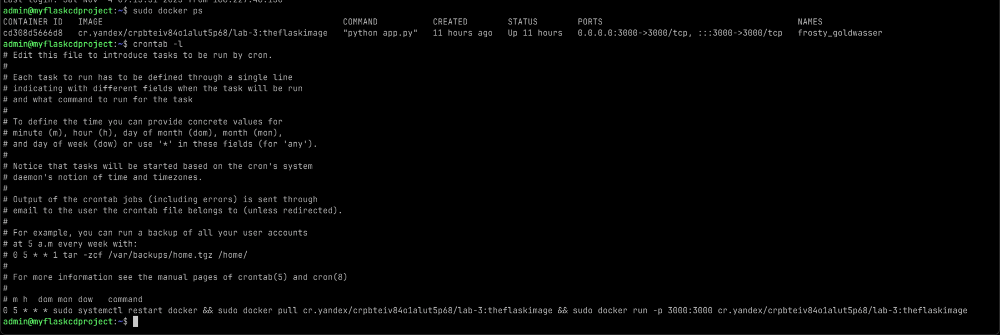

# cloud-stuff-lab-3

Репозиторий для 3 лабораторной работе по облачным технологиям

## Команда Облаке

### Состав команды

К3243 <- **Самсонов Александр Александрович** - капитан  
K3242 <- Мельник Софья  
K3240 <- Цой Степан Алексеевич  
К3220 <- Луценко Владимир Витальевич  

## Теория

**Лабораторная 3**

> Сделать, чтобы после пуша в ваш репозиторий автоматически собирался докер образ и результат его сборки сохранялся
> куда-нибудь. (например, если результат - текстовый файлик, он должен автоматически сохраниться на локальную машину, в
> ваш репозиторий или на ваш сервер).

**Лабораторная 3 со звёздочкой**

> Сделать красиво работу с секретами. Например, поднять Hashicorp Vault и сделать так, чтобы ci/cd пайплайн ходил туда,
> брал секрет, использовал его не светя в логах. Можно развернуть всё на локальной машине.

## Что мы сделали

В папке `src` лежит минимально функциональный сайт на _flask_, который считает посетителей. Он работает на 3000 порте, я
планирую автоматически деплоить этот контейнер в yandex serverless cloud, на данный момент он просто отправляется
в [этот репозиторий dockerhub](https://hub.docker.com/repository/docker/mayonnaiseslap/lab-3/general).

[Ссылка на загруженный проект](http://84.201.185.192:3000/), если он крутится.

Оно автоматически грузится в регистр яндекса, а вм оттуда берет и крутит контейнер.

## Разбор workflows

``` yaml
name: Docker Image CI

on:
  push:
    branches: [ "main" ] <- Это уже деплой контейнера, а значит происходит при пуше в мэйн

jobs:

  build:

    runs-on: ubuntu-latest

    steps:
      - uses: actions/checkout@v3
      - name: Build the Docker image
        run: docker build . --file Dockerfile --tag mayonnaiseslap/lab-3:theflaskimage   <- Это писалось чтобы деплоить на докерхаб
      #      - name: Docker Login                                                              <- закомменченый код для отправки в докерхаб
      #        run: docker login -u ${{ secrets.DOCKER_HUB_USERNAME }} -p ${{ secrets.DOCKER_HUB_PASSWORD }}   <- секретики для логина
      #      - name: Push image to docker registry
      #        run: docker push mayonnaiseslap/lab-3:theflaskimage                             <- Это все было не обязательно комментить, но 
      #                                                                                            так быстрее обновлялся образ у яндекса
      - name: rename image to upload to yandex
        run: docker tag mayonnaiseslap/lab-3:theflaskimage cr.yandex/${{ secrets.YANDEX_CONTAINER_REGISTRY_ID }}/lab-3:theflaskimage  <- можно было конечно сразу так назвать...
      - name: Push image to yandex registry
        run: docker login --username oauth  --password ${{ secrets.YANDEX_CONTAINER_AUTH_TOKEN }} cr.yandex && docker push cr.yandex/${{ secrets.YANDEX_CONTAINER_REGISTRY_ID }}/lab-3:theflaskimage
                                                       ^^^^^^^^^^^^^^^^^^^^^^^^^^^^^^^^^^^^^^^^^         <- секретики ->            ^^^^^^^^^^^^^^^^^^^^^^^^^^^^^^^^^^^^^^^^^^^
```

VM яндекса крутится 24 часа, каждый раз в 4 утра она выполняет chrontab скрипт

Скриншот из терминала VM



По работе с яндекс cloud, их serverless container и ВМ можно написать отдельный отчет. Все почти удобно, но документация
какая-то скудная. Даже getting started гайды не всегда полностью актуальны, а более углубленная документация, бывает,
очень... WIP. Она написана _крайне_ техническим языком, что не получается разобраться и приходится искать
сторонние разборы, гайды и даже документацию похожих сервисов. У MS AZURE мне _**очень**_ понравилась документация.

---

## Плохие практики

В данном проекте данные о посетителях хранятся внутри контейнера, но исправление этого, кажется, того не стоит

## Выводы по лабораторной работе

Мы научились работать с ci/cd инструментарием гитхаба через github actions, а также использовать секреты. Эта реализация
не претендует на статус **со звездочкой**, но секреты все равно существуют. Не хочется в публичный репозиторий грузить
auth токены
